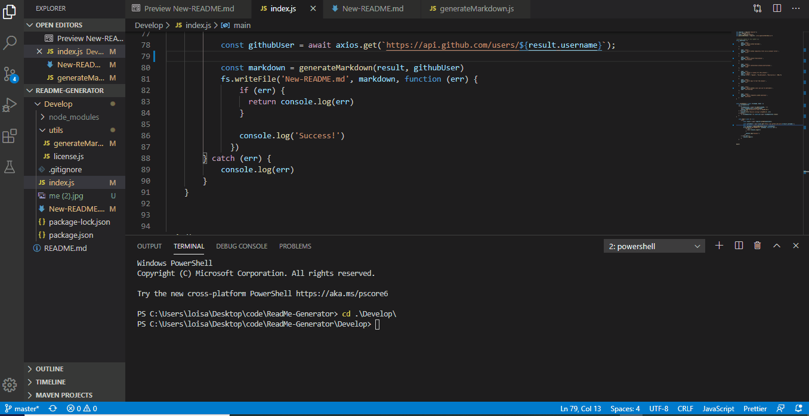

# README Generator

## Description
Created a command-line application that dynamically generates a README.md from a user's input. This application is invoked with the following command:
```sh
node index.js
```
The user will be prompted for their GitHub username, which will be used to make a call to the GitHub API to retrieve their email and profile image. They will then be prompted with questions about their project.

## Table of Contents
* Project title
* Description
* Table of Contents
* Installation
* Usage
* Contributing
* Questions
  * User GitHub profile picture
  * User GitHub email

## Installations
* First go into folder Develop : cd develop
* Enter node index.js
* Answer various questions, these will be the information used to generate readme

## Usage


## Contributing
Contributions to this projected are accepted, please use contact information below to reach me

## Questions
Name: Lois Aleghe
Email: Loisaleghe@cmail.carleton.ca


- - -
© 2020 Lois Aleghe. All Rights Reserved.
